<h1 align="center">
    𝘏𝘦𝘭𝘭𝘰 𝘦𝘷𝘦𝘳𝘺𝘰𝘯𝘦! 𝘐'𝘮 𝘚𝘵𝘦𝘧𝘢𝘯 𝘒𝘭𝘦𝘱𝘪𝘬𝘰𝘸, 𝘢𝘬𝘢 <a href="https://stefplotva.ru/">
        𝘖𝘨𝘳𝘢𝘭𝘭
    </a>.
</h1>
<div align="center">
    Feel free and take a look at my GitHub account below!
</div>

---

<h2>
    My Skills :computer::
</h2>
<div align="center">
    
    
    
    
    
    
    
    
    
    
    
    
    
    
    
</div>
<h2>
    My GitHub statistics :bar_chart::
</h2>
<div align="center">
    <picture>
        <source srcset="./assets/stats_dark.svg" media="(prefers-color-scheme: dark)" /> <!-- Dark mode -->
         <!-- Light mode -->
    </picture>
    <picture>
        <source srcset="./assets/top_langs_dark.svg" media="(prefers-color-scheme: dark)" /> <!-- Dark mode -->
         <!-- Light mode -->
    </picture>
</div>

[](https://github.com/ashutosh00710/github-readme-activity-graph)

<h2>
My weekly coding statistic breakdown :muscle::
</h2>

<!--START_SECTION:waka-->


**🐱 My GitHub Data** 

> 📦 ? Used in GitHub's Storage 
 > 
> 🏆 53 Contributions in the Year 2026
 > 
> 💼 Opted to Hire
 > 
> 📜 2 Public Repositories 
 > 
> 🔑 0 Private Repositories 
 > 
**I'm a Night 🦉** 

```text
🌞 Morning                14 commits          █░░░░░░░░░░░░░░░░░░░░░░░░   04.11 % 
🌆 Daytime                61 commits          ████░░░░░░░░░░░░░░░░░░░░░   17.89 % 
🌃 Evening                206 commits         ███████████████░░░░░░░░░░   60.41 % 
🌙 Night                  60 commits          ████░░░░░░░░░░░░░░░░░░░░░   17.60 % 
```
📅 **I'm Most Productive on Sunday** 

```text
Monday                   28 commits          ██░░░░░░░░░░░░░░░░░░░░░░░   08.21 % 
Tuesday                  52 commits          ████░░░░░░░░░░░░░░░░░░░░░   15.25 % 
Wednesday                35 commits          ███░░░░░░░░░░░░░░░░░░░░░░   10.26 % 
Thursday                 27 commits          ██░░░░░░░░░░░░░░░░░░░░░░░   07.92 % 
Friday                   68 commits          █████░░░░░░░░░░░░░░░░░░░░   19.94 % 
Saturday                 42 commits          ███░░░░░░░░░░░░░░░░░░░░░░   12.32 % 
Sunday                   89 commits          ███████░░░░░░░░░░░░░░░░░░   26.10 % 
```


📊 **This Week I Spent My Time On** 

```text
💬 Programming Languages: 
Markdown                 3 hrs 34 mins       ██████████████████░░░░░░░   71.40 % 
TypeScript               1 hr 19 mins        ███████░░░░░░░░░░░░░░░░░░   26.44 % 
JavaScript               3 mins              ░░░░░░░░░░░░░░░░░░░░░░░░░   01.28 % 
Python                   1 min               ░░░░░░░░░░░░░░░░░░░░░░░░░   00.66 % 
Prolog                   0 secs              ░░░░░░░░░░░░░░░░░░░░░░░░░   00.16 % 

🔥 Editors: 
VS Code                  4 hrs 59 mins       █████████████████████████   100.00 % 

🐱‍💻 Projects: 
OgrallSerebroust         3 hrs 33 mins       ██████████████████░░░░░░░   71.29 % 
TaskForLaretto           1 hr 24 mins        ███████░░░░░░░░░░░░░░░░░░   28.23 % 
Prolog-for-studing       0 secs              ░░░░░░░░░░░░░░░░░░░░░░░░░   00.17 % 
my_python_projects       0 secs              ░░░░░░░░░░░░░░░░░░░░░░░░░   00.16 % 
web_for_myself           0 secs              ░░░░░░░░░░░░░░░░░░░░░░░░░   00.09 % 

💻 Operating System: 
Windows                  4 hrs 59 mins       █████████████████████████   100.00 % 
```

🤖 **AI Coding This Week** 

```text
No AI Coding Activity Tracked This Week
```

**I Mostly Code in Python** 

```text
Python                   9 repos             ████████████░░░░░░░░░░░░░   50.00 % 
CSS                      3 repos             ████░░░░░░░░░░░░░░░░░░░░░   16.67 % 
PHP                      2 repos             ███░░░░░░░░░░░░░░░░░░░░░░   11.11 % 
Prolog                   1 repo              █░░░░░░░░░░░░░░░░░░░░░░░░   05.56 % 
Kotlin                   1 repo              █░░░░░░░░░░░░░░░░░░░░░░░░   05.56 % 
```


**Timeline**


<!--END_SECTION:waka-->


<!--
**OgrallSerebroust/OgrallSerebroust** is a ✨ _special_ ✨ repository because its `README.md` (this file) appears on your GitHub profile.

Here are some ideas to get you started:

- 🔭 I’m currently working on ...
- 🌱 I’m currently learning ...
- 👯 I’m looking to collaborate on ...
- 🤔 I’m looking for help with ...
- 💬 Ask me about ...
- 📫 How to reach me: ...
- 😄 Pronouns: ...
- ⚡ Fun fact: ...
-->
