<h1 align="center">
    𝘏𝘦𝘭𝘭𝘰 𝘦𝘷𝘦𝘳𝘺𝘰𝘯𝘦! 𝘐'𝘮 𝘚𝘵𝘦𝘧𝘢𝘯 𝘒𝘭𝘦𝘱𝘪𝘬𝘰𝘸, 𝘢𝘬𝘢 <a href="https://stefplotva.ru/">
        𝘖𝘨𝘳𝘢𝘭𝘭
    </a>.
</h1>
<div align="center">
    Feel free and take a look at my GitHub account below!
</div>

---

<h2>
    My Skills :computer::
</h2>
<div align="center">
    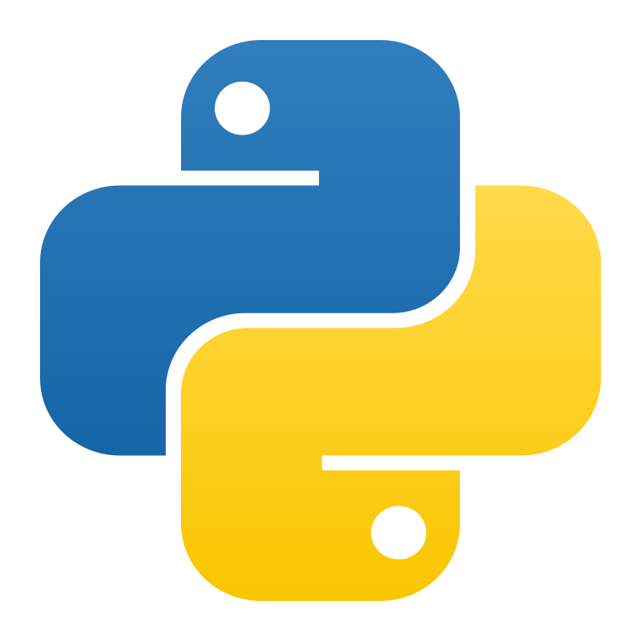
    
    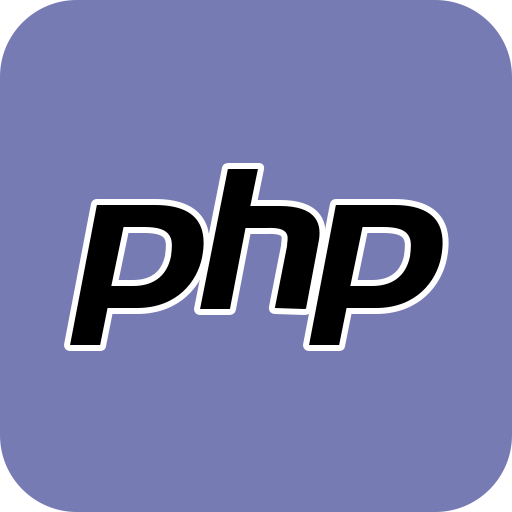
    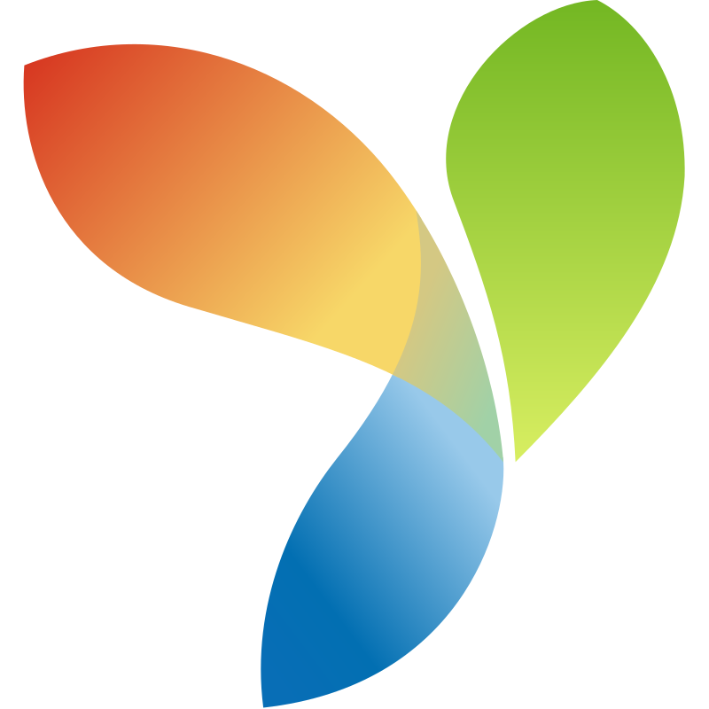
    
    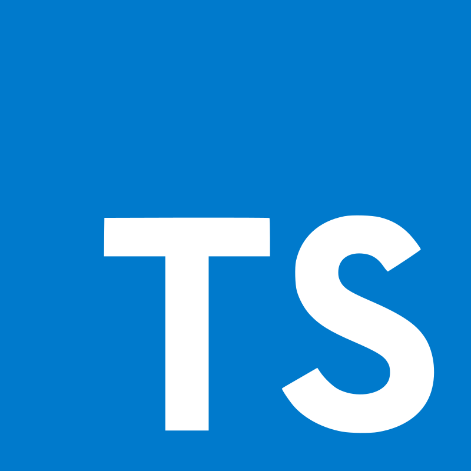
    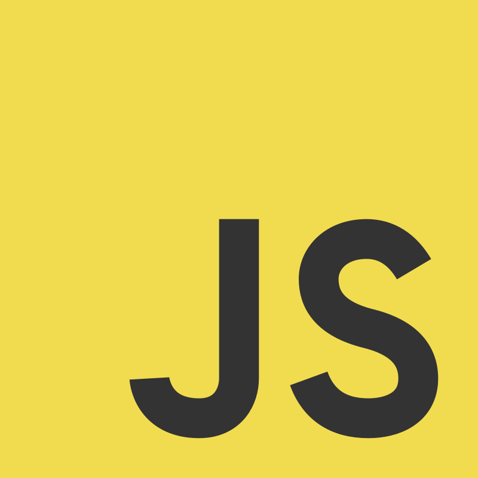
    
    
    
    
    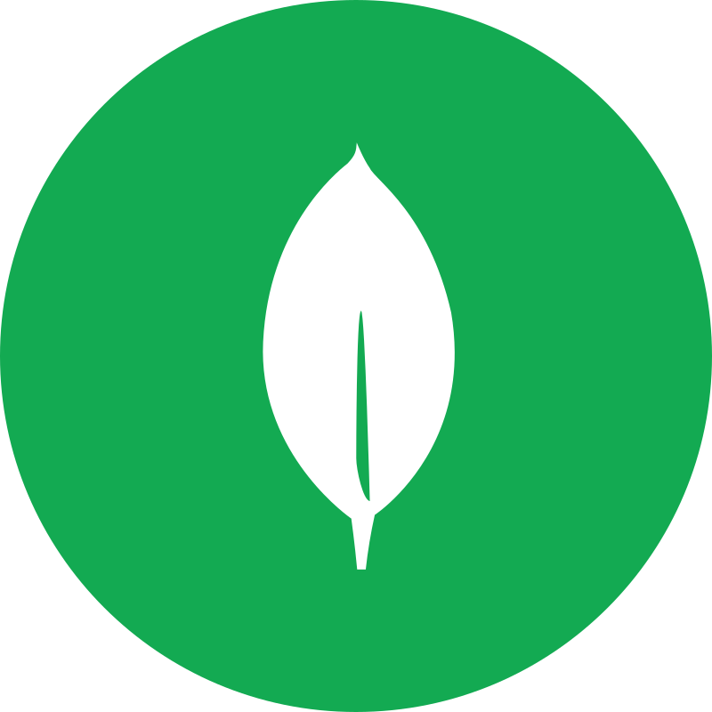
    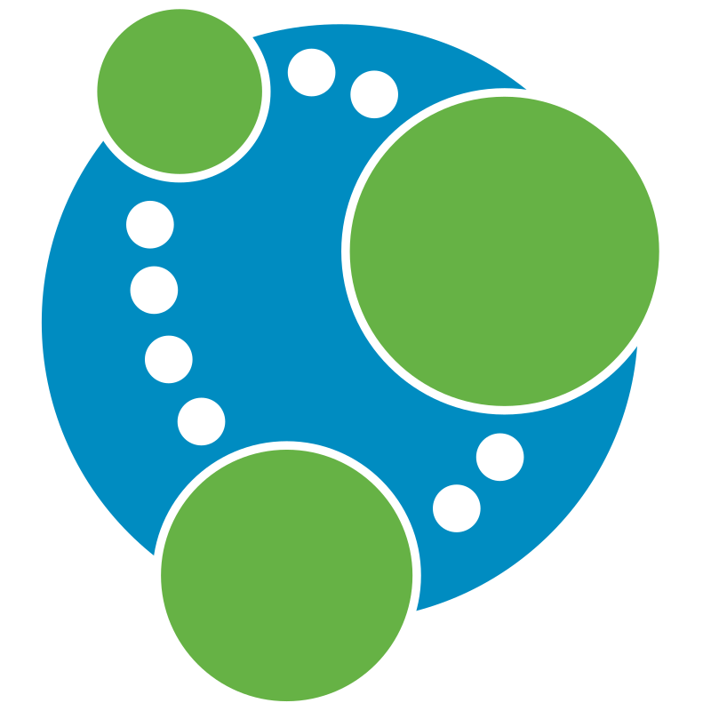
    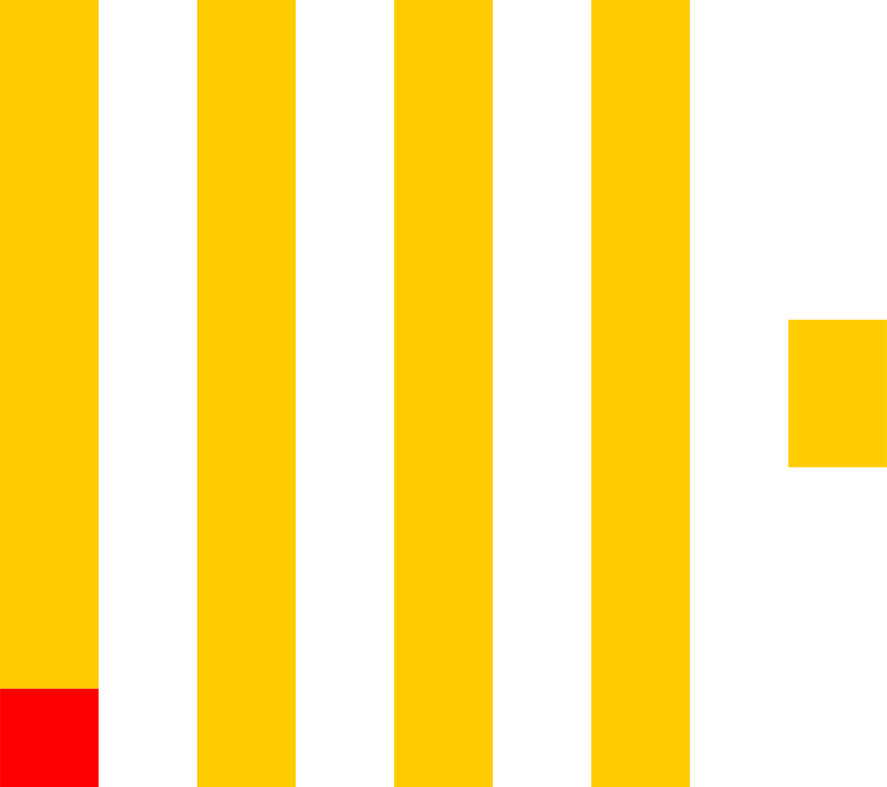
    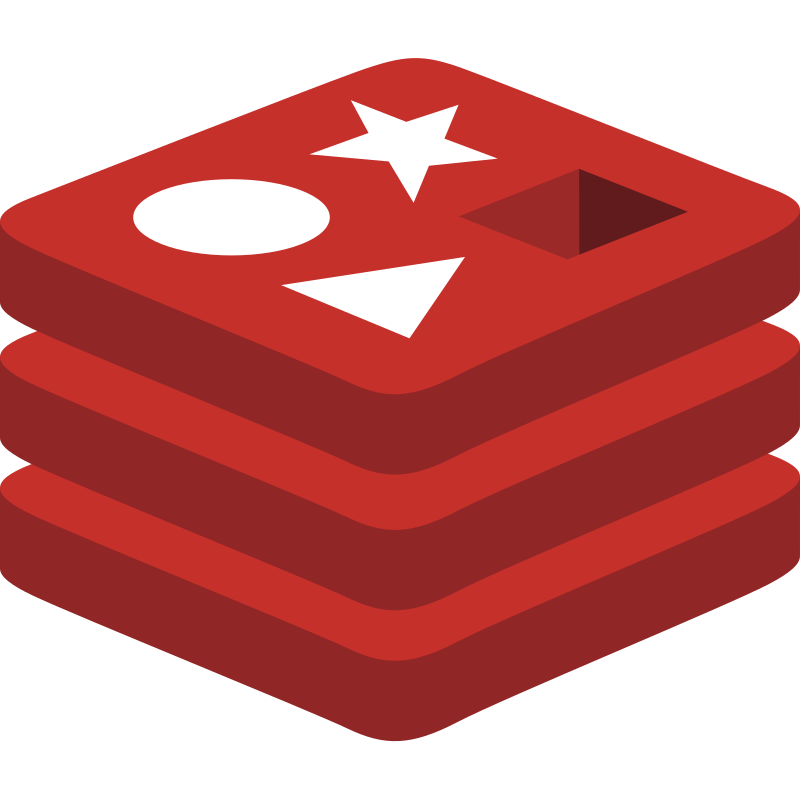
    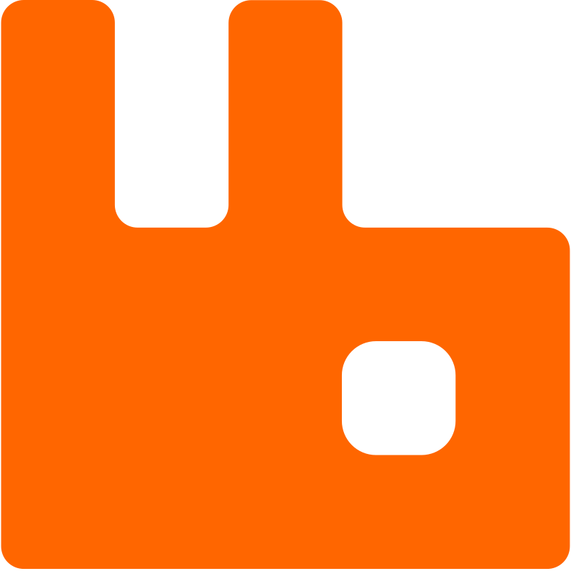
    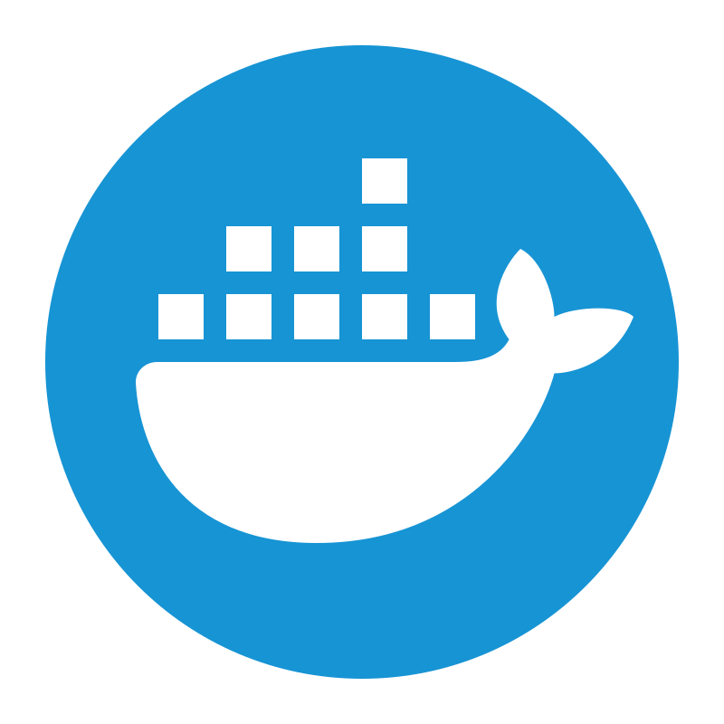
    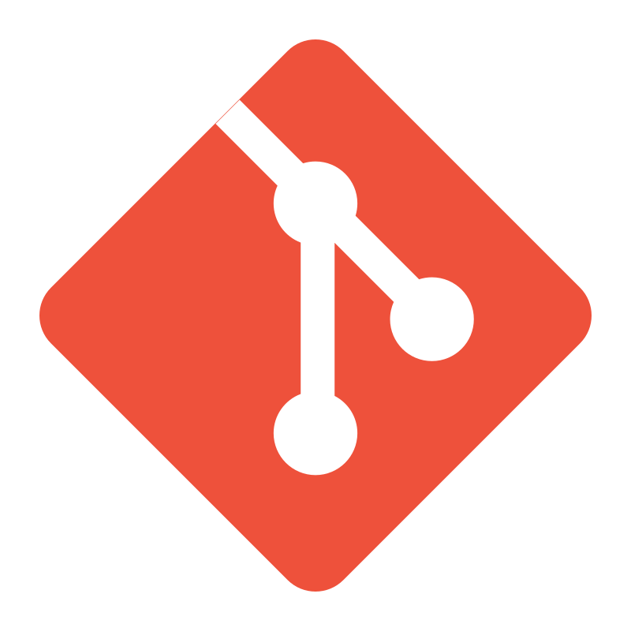
</div>
<h2>
    My GitHub statistics :bar_chart::
</h2>
<div align="center">
    <picture>
        <source srcset="./assets/stats_dark.svg" media="(prefers-color-scheme: dark)" /> <!-- Dark mode -->
         <!-- Light mode -->
    </picture>
    <picture>
        <source srcset="./assets/top_langs_dark.svg" media="(prefers-color-scheme: dark)" /> <!-- Dark mode -->
         <!-- Light mode -->
    </picture>
</div>
<div align="center">
    <picture>
        <source srcset="./assets/contribution_graph_dark.svg" media="(prefers-color-scheme: dark)" /> <!-- Dark mode -->
         <!-- Light mode TODO ???-->
    </picture>
</div>
<h2>
My weekly coding statistic breakdown :muscle::
</h2>

<!--START_SECTION:waka-->


**🐱 My GitHub Data** 

> 📦 ? Used in GitHub's Storage 
 > 
> 🏆 107 Contributions in the Year 2026
 > 
> 💼 Opted to Hire
 > 
> 📜 10 Public Repositories 
 > 
> 🔑 0 Private Repositories 
 > 
**I'm a Night 🦉** 

```text
🌞 Morning                9 commits           ░░░░░░░░░░░░░░░░░░░░░░░░░   01.82 % 
🌆 Daytime                125 commits         ██████░░░░░░░░░░░░░░░░░░░   25.25 % 
🌃 Evening                334 commits         █████████████████░░░░░░░░   67.47 % 
🌙 Night                  27 commits          █░░░░░░░░░░░░░░░░░░░░░░░░   05.45 % 
```
📅 **I'm Most Productive on Sunday** 

```text
Monday                   92 commits          █████░░░░░░░░░░░░░░░░░░░░   18.59 % 
Tuesday                  107 commits         █████░░░░░░░░░░░░░░░░░░░░   21.62 % 
Wednesday                31 commits          ██░░░░░░░░░░░░░░░░░░░░░░░   06.26 % 
Thursday                 17 commits          █░░░░░░░░░░░░░░░░░░░░░░░░   03.43 % 
Friday                   32 commits          ██░░░░░░░░░░░░░░░░░░░░░░░   06.46 % 
Saturday                 50 commits          ███░░░░░░░░░░░░░░░░░░░░░░   10.10 % 
Sunday                   166 commits         ████████░░░░░░░░░░░░░░░░░   33.54 % 
```


📊 **This Week I Spent My Time On** 

```text
💬 Programming Languages: 
Markdown                 2 hrs 53 mins       █████████████████░░░░░░░░   68.75 % 
Python                   48 mins             █████░░░░░░░░░░░░░░░░░░░░   18.97 % 
YAML                     21 mins             ██░░░░░░░░░░░░░░░░░░░░░░░   08.38 % 
TOML                     5 mins              █░░░░░░░░░░░░░░░░░░░░░░░░   02.26 % 
Text                     1 min               ░░░░░░░░░░░░░░░░░░░░░░░░░   00.76 % 

🔥 Editors: 
VS Code                  4 hrs 13 mins       █████████████████████████   100.00 % 

🐱‍💻 Projects: 
hh_rob                   2 hrs 24 mins       ██████████████░░░░░░░░░░░   56.95 % 
OgrallSerebroust         1 hr 43 mins        ██████████░░░░░░░░░░░░░░░   40.83 % 
TaskForLaretto           3 mins              ░░░░░░░░░░░░░░░░░░░░░░░░░   01.49 % 
main_gate                1 min               ░░░░░░░░░░░░░░░░░░░░░░░░░   00.72 % 

💻 Operating System: 
Windows                  4 hrs 13 mins       █████████████████████████   100.00 % 
```

🤖 **AI Coding This Week** 

```text
No AI Coding Activity Tracked This Week
```

**I Mostly Code in Python** 

```text
Python                   4 repos             ██████████████░░░░░░░░░░░   57.14 % 
TypeScript               1 repo              ████░░░░░░░░░░░░░░░░░░░░░   14.29 % 
JavaScript               1 repo              ████░░░░░░░░░░░░░░░░░░░░░   14.29 % 
HTML                     1 repo              ████░░░░░░░░░░░░░░░░░░░░░   14.29 % 
```


**Timeline**


<!--END_SECTION:waka-->


<!--
**OgrallSerebroust/OgrallSerebroust** is a ✨ _special_ ✨ repository because its `README.md` (this file) appears on your GitHub profile.

Here are some ideas to get you started:

- 🔭 I’m currently working on ...
- 🌱 I’m currently learning ...
- 👯 I’m looking to collaborate on ...
- 🤔 I’m looking for help with ...
- 💬 Ask me about ...
- 📫 How to reach me: ...
- 😄 Pronouns: ...
- ⚡ Fun fact: ...
-->
